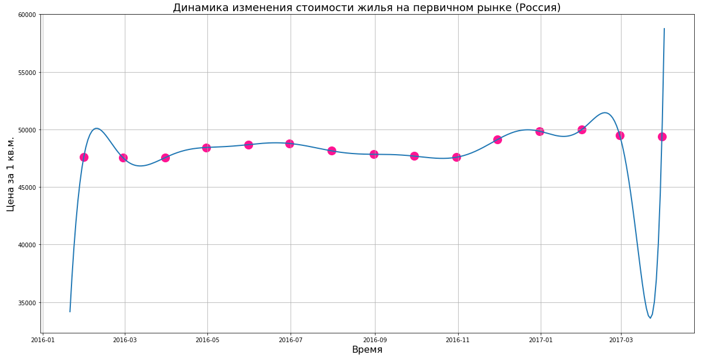

# Интерполяционный многочлен Лагранжа
> Реализация алгоритма интерполяции данных на языке Python для неравноотстоящих точек, основанного на формуле Лагранжа. Вначале кода предлагается задать значения для корректной работы алгоритма. Настроечные параметры обеспечат наглядный и информативный вывод графика. Получение многочлена происходит в не явном виде, чтобы увеличить производительность алгоритма. 

> Настроечные параметры:
- В переменной **path_file** задаётся путь к CSV-файлу
- В переменной **delim** указывается разделитель между первым и вторым столбцами
- В переменных **x_title** и **y_title** указываются заголовки по осям X и Y соответственно
- В переменной **graphic_title** указывается заголовок графика
- В переменной **number_point** указывается количество точек для рисования функции в диапазоне интерполяции (влияет на сглаженность линии)
- В переменной **range_start** указывается начало диапазона интерполяции
- В переменной **range_number** указывается количество точек для интерполяции
- В переменной **extension_left** указывается значение в %, на которое будет увеличен интервал рисования графика функции Лагранжа справа от последней точки интерполяции
- В переменной **extension_right** указывается значение в %, на которое будет увеличен интервал рисования графика функции Лагранжа слева от первой точки интерполяции

> Основу алгоритма составляет функция **lagran**:
```Python
def lagran(f_x):   # функция, реализующая вычисление в заданной точке по оси х значения y
  accumulation = 0.0         # Накапливаем сумму всех слагаемых 
  for i in range(len(x)):
    multiplication = 1.0     # Записываем значение всех умноженных скобок в рамках одного слагаемого
    for ii in range(len(x)):
      if ii != i:
        multiplication = multiplication*(f_x - x[ii]) / (x[i] - x[ii])
    accumulation = accumulation + multiplication*y[i]
  return accumulation
```

> Вышеприведённый код реализует следующие математические формулы: 


> Структура файла CSV должна быть приведена в соответствие со следующими принципами: 
 - В первом столбце должны быть значения даты в формате DD.MM.YYYY
 - Во втором столбце должны быть значения действительных чисел, которые будут располагаться по оси Y

> Результат выполнения с файлом CSV, расположенным в папке **Example** можно увидеть ниже:


